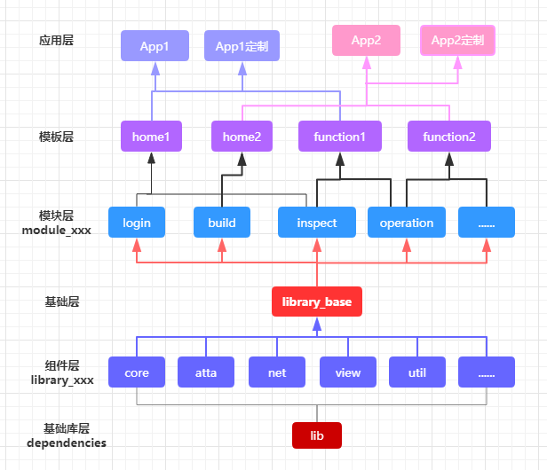

# MVVM模块化快速开发框架说明

## 1. 框架优势

## 2. 框架概述



该框架将项目拆分为多个模块，根据模块性质可对其分层，从下到上分别为**基础库层**、**组件层**、**基础层**、**模块层**、"模板层"、"应用层"。分层的结构有利于项目模块化管理，使得框架易于扩展和维护，避免因为项目数量和体量的增加导致代码纵横交错不便管理。

### 2.1 基础库层

该层主要指框架中依赖的一些优秀的开源库或者google官方库，其配置在根目录下`conf_lib.gradle`中，然后根据类库性质在不同的module下添加依赖。为了保证架构清晰，应该尽量遵守这一规则，当然也不是强求的，在充分了解框架后，可以根据自己需求做灵活变动，重要的是理解这种设计的意义。

比如[AndroidX](https://developer.android.google.cn/jetpack)、[RxJava](https://github.com/ReactiveX/RxJava)、[ARouter](https://github.com/alibaba/ARouter/blob/master/README_CN.md)等这些几乎所有项目都需要，而且内容不太多的类库，我们在**library_core**组件下依赖。而一些内容较多需要二次开发且功能单一的，通常需要新建一个组件**library_xxx**，相关依赖在对应组件中添加，详情请看下面组件层说明。

### 2.2 组件层

项目通用的类库称之为组件层，将这些库按功能划分，将其拆分为多个组件，在工程中以**library_xxx**的形式存在，它们被放在library文件夹中。

其中最重要的是**library_core**，该组件称之为核心组件，其包含供整个框架使用的内容，比如网络请求、工具库、基类以及主题规范等资源文件。核心组件是框架最底层的模块，所有其他组件都应该依赖它，而它不能依赖其他组件，如果出现循环依赖会导致项目报错，这时候应该考虑将被它依赖的组件融入核心组件。

其他的组件是可扩展的组件，其数量不定，根据自己需求封装，比如标配的数据库组件**library_db**，其使用了[greenDAO](https://github.com/greenrobot/greenDAO)这款ORM框架，它能将Java对象映射到SQLite数据库中，在操作数据库的时候，不再需要编写复杂的SQL语句，在性能方面，greenDAO针对Android进行了高度优化，最小的内存开销、依赖体积小同时还是支持数据库加密。

### 2.3 基础层

基础层**library_base**(`开源的框架中为library_frame`)作为**框架组件层**和**业务模块层**的桥梁，主要用于组织各组件层和一些基础库层，形成整个项目**基础框架**，供业务模块层及应用层使用。它起到组织并隐蔽组件层，让我们在开发业务模块时不必关心底层组件的作用。所有业务模块以及上层模板应用层都应该依赖它，而不是分别依赖底层组件。

**思考**：既然组件层基础层都是底层封装的类库，为什么还要对其分层？直接都揉到一层就行了。

> 通常情况下如果某个组件功能比较多，或者包含很多资源文件，将其抽取成为单独的组件，以保持底层类库整洁便于维护，而**library_base**的作用就是将这些类库组件汇总形成整个框架并向上暴露。

### 2.4 模块层

模块层位于module文件夹下以**module_**开头命名的模块，是独立的业务模块集合，是组成应用的最小单位，比如一个项目中的登录、个人、视频等业务功能都需要划分为独立的模块，他们被放在module文件夹中，从这一层开始就是我们真正项目开发的内容了。

该层所有模块`build.gradle`可使用统一的gradle脚本，内容如下(`module.gradle`是统一抽取的脚本文件，位于module文件夹中)：

```xml
apply from: "../module.gradle"
//当然也可以在build.gradle中根据需求自由配置
```

### 2.5 模板层

模板层是位于template文件夹下以**template_**开头命名的模块，它依赖于多个模块层，将功能模块整合为一个完整的app，其中包含了`Application`和主页面等功能，可以看作是app的打包层。但是有的应用可能涉及到分渠道打包或者特殊定制，所以抽取出模板层，而将打包任务放到应用层。也就是说如果没有特殊定制需求，可以把该层直接当作应用层。

该层`build.gradle`可使用统一的gradle脚本，内容如下(`temlate.gradle`是统一抽取的脚本文件，位于template文件夹下)：
  
```xml
apply from: "../temlate.gradle"
//根据业务需求添加模块依赖
dependencies {
    implementation project(':module:module_login')   
    implementation project(':module:module_setting')
    implementation project(':module:module_video')
    //...
}
```

### 2.6 应用层

应用层位于app文件夹下以**app_**开头命名的模块，它的作用就是配置打包相关脚本，实现资源文件的定制等功能。

该层`build.gradle`可使用统一的gradle脚本，内容如下(`app.gradle`是统一抽取的脚本文件，位于app文件夹下)：
  
```xml
apply from: '../app.gradle'
android {
    signingConfigs {
        release {
            keyAlias '掌上119重点版签名'
            keyPassword 'xxx'
            storeFile file('../../keystory/bj_zs119_zd.jks')
            storePassword 'xxx'
            v1SigningEnabled true
            v2SigningEnabled true
        }
        debug {
            keyAlias '掌上119重点版签名'
            keyPassword 'xxx'
            storeFile file('../../keystory/bj_zs119_zd.jks')
            storePassword 'xxx'
            v1SigningEnabled true
            v2SigningEnabled true
        }
    }

    //配置资源文件路径，可动态指定不同版本资源文件
    sourceSets {
        //用各自对应的资源文件路径
        xiaofang.res.srcDirs = ['src/main/res']
        jichang.res.srcDirs = ['src/main/res-jichang']
        taiwen.res.srcDirs = ['src/main/res-taiwen']
        crert.res.srcDirs = ['src/main/res-crert']
        jichang.java.srcDirs = ['src/main/java-jichang']
        crert.java.srcDirs = ['src/main/java-crert']
    }

    //声明维度,  配置优先级：version>new>defaultConfig
    flavorDimensions "version"/*, "new"*/
    // 构建渠道
    productFlavors {
        xiaofang {
            dimension "version"
            println "构建多渠道配置--消防"
        }
        jichang {
//            applicationId "com.fzy.hbmjc"
            dimension "version"
            println "构建多渠道配置--机场"
        }
        taiwen {
//            applicationId "com.fzy.hbmjc"
            dimension "version"
            println "构建多渠道配置--泰文"
        }
        crert {
//            applicationId "com.fzy.hbmjc"
            dimension "version"
            println "构建多渠道配置--科锐"
        }
    }
}
dependencies {
    implementation project(':template:template_xxx')
}
```

### 2.7 总结

框架的分层是可以根据自己需求灵活控制的，但需要充分了解框架设计意图。需要明确的是框架类库层**library**目录下的分层，以及一些脚本文件不要轻易改动，它们是框架良好应用的基础，模块层业务划分是需要根据项目需求自行处理的，模板层和应用层也需要根据自己需求安排。当然目前的分层可以轻松实现多个项目的开发和维护，已经在公司项目上得到良好应用，开发时并不需要管纠结这么多，框架存在的意义就是让开发者专注于业务代码的开发而隐藏底层细节。

## 3. 命名规范

为了保证框架的清洁和便于维护，应当严格遵守框架命名规范，包括创建module时命名，资源文件、类文件命名，请参考现有命名原则。

> 为了防止资源冲突以及维护方便，无论什么资源文件，其名称中必须包含组件、模块、模板的名称（以它开头）
- **module**<br/>
> **library_组件名**、**module_模块名**、**template_模板名**、**app_应用名**<br/>
- **drawable & mipmap**<br/>
> **module名称_文件类型_文件名**，如：core_icon_crash_error.png、core_shape_btn_green.xml
- **layout**<br/>
> **module名称_文件类型_文件名**，如：core_toast_layout.xml、core_activity_crash_error_def.xml、core_fragment_xxx.xml
- **value**
> **xxx_**

其他没有考虑到的请自行确定规则

## 4. gradle脚本配置

### 4.1 conf_lib.gradle

位于`config`目录下，用于配置依赖的类库和框架统一的android扩展配置，所有module中的`build.gradle`添加依赖应该使用该脚本中的依赖，以及android配置，方便版本管理

### 4.2 conf_app.gradle

位于`config`目录下，用于配置Android项目的包名、版本号以及一些`BuildConfig`常量。

由于该框架设计允许在一个工程下同时开发多个项目，所以`conf_app.gradle`中可以配置多个项目，通过其中的`appTypeStr = "TYPE_ALONG"`配置切换当前想要运行的项目。当开发一个新的项目时，请在`library\library_core\src\main\java\com\fpc\core\config\AppTypes.java`中添加该项目的枚举类型。

如果在某个module编码中需要判断当前运行的项目版本(该模块可能被多个项目共用，而有一部分内容在多个项目中作区别处理)，请使用`if(AppTypes.XXX == AppTypes.valueOf(AppConfig.appType))`

### 4.3 其他gradle脚本

每个module都对应自己的`build.gradle`脚本，其中module、template、app文件夹下分别抽取了各层通用的脚本文件，各module应该在应用这些封装的脚本的前提下，根据需求再进行扩充


# 框架接入

## 1. 准备工作


## 2. 快速上手

### 2.1 

### 2.1 Application

请继承`com.openxu.core.application.XCoreApplication`，如果不能继承该类，请在自己的Application的onCreate方法中完成类库初始化：
```xml
//初始化类库
XAppInitManager.init(this);
```

如果某个模块需要在`Application`创建时完成相关初始化操作，请继承`com.openxu.core.application.XBaseAppLogic`在`onApplicationCreate(String processName)`方法中完成初始化，其中processName是当前进程名，然后在`conf_app.gradle`脚本中配置`applicationInitClass`，有多个模块初始化类用`,`隔开：

- 继承XBaseAppLogic编写初始化逻辑

```Java
/**
 * Author: openXu
 * Time: 2019/2/23 14:49
 * class: ModuleXXXInitLogic
 * Description: 示例：ModuleXXX模块需要在Application启动时初始化的内容，在onApplicationCreate中完成初始化
 */
public class ModuleXXXInitLogic extends XBaseAppLogic {
    @SuppressLint("RestrictedApi")
    @Override
    public void onApplicationCreate(String processName) {
        /*
         * 如果应用有多个进程，而初始化逻辑只需要在主进程，可使用processName.equals(AppConfig.appId)判断，
         * 其中processName是当前启动的Applicaiton进程名，AppConfig.appId为应用包名（主进程）
         */
        if (processName.equals(AppConfig.appId)) {
            //初始化友盟统计
            UMConfigure.init(mApplication, xxx,"Umeng", xxx,xxx);
            //初始化极光推送
            JPushInterface.init(mApplication);
            //...
        }
    }
}
```

- 配置初始化类

```xml
//配置某个应用的BuildConfig常量
Map<String, String> getConfigMap_test() {
    return [
        //Application初始化类，使用,分割
        applicationInitClass :"\"com.openxu.english.ModuleXXXInitLogic,com.openxu.english.AppInitLogic\""
    ]
}
```

### 2.1 


 